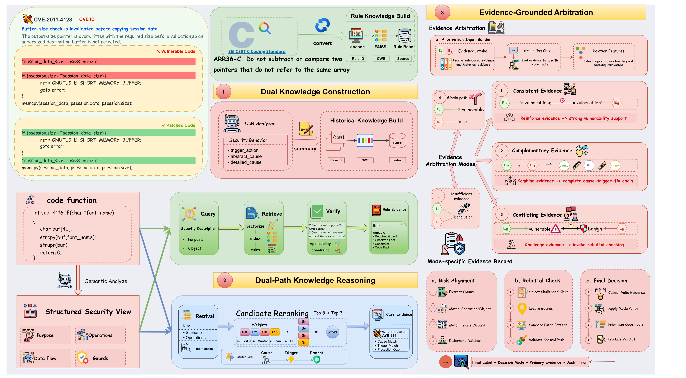

# VulDuet

VulDuet 是一个面向大语言模型源代码漏洞检测的**双路径知识增强框架**。框架将规范性安全规则与历史漏洞案例分别建模：规则知识路径用于判断代码是否违反安全约束，历史知识路径用于匹配相似的漏洞场景、触发条件与修复模式。两条路径产生的证据经过统一表示与仲裁，最终输出可追溯的漏洞判断。

## 框架概览

<p align="center">
  
</p>

VulDuet 的主要流程如下：

1. **安全语义分析（Security Semantic Analysis）**：从目标函数中提取功能目的、安全敏感对象、关键操作、数据流与保护条件。
2. **规则知识路径（Rule Knowledge Path）**：检索 SEI CERT 风格安全规则，验证规则的适用性及约束是否被违反。
3. **历史知识路径（Historical Knowledge Path）**：构造场景查询，召回历史漏洞知识，经重排与场景过滤后分析漏洞根因、触发条件和修复方式。
4. **证据标准化（Evidence Normalization）**：将双路径结论统一为包含来源、极性、代码依据、置信度和溯源信息的证据记录。
5. **证据仲裁（Evidence Arbitration）**：识别证据一致、互补或冲突关系，经风险对齐、反证检查和决策策略输出最终标签、主要证据与决策模式。

当前公开实现对应 **V4 检索流程**与 **V3 证据仲裁器**。

## 目录结构

```text
src/
  agent/          安全语义分析、双路径推理、重排与证据仲裁
  config/         模型配置和本地凭据加载
  dataset/        PrimeVul 成对样本加载器
  embedding/      BGE 向量表示封装
  retrival/       规则知识与历史知识的 FAISS 检索
  evaluation/     常规指标与成对评估指标
  util/           证据结构、数据泄漏审计、日志和结果保存
  test/           双路径实现的单元测试
  main_*_v4.py    PrimeVul 与 SVEN 实验入口
server_v4/        Linux 环境配置、运行和结果检查脚本
```

目录名 `retrival` 为兼容现有 Python 导入路径而保留。

## 环境安装

推荐使用 Python 3.10 或更高版本。

```bash
git clone https://github.com/zhanghong203/VulDuet.git
cd VulDuet
python -m venv .venv
```

激活虚拟环境并安装依赖：

```bash
# Linux/macOS
source .venv/bin/activate

# Windows PowerShell
# .venv\Scripts\Activate.ps1

pip install -r requirements.txt
```

`FlagEmbedding` 会在首次运行时下载配置的 BGE 模型。设置 `RULE_RAG_EMBEDDING_DEVICE=cpu` 可强制使用 CPU；若未设置且 CUDA 可用，程序默认使用 `cuda:0`。

## 大模型配置

公开的模型名称与 OpenAI 兼容接口地址位于 `src/config/config.yml`。API 密钥只应保存在本地配置中：

```bash
cp src/config/config.local.example.yml src/config/config.local.yml
```

在 `src/config/config.local.yml` 中填写密钥：

```yaml
llm_profiles:
  deepseek_v3_2:
    api_key: "YOUR_API_KEY"
```

该本地文件已被 Git 忽略。请勿提交 API Key、访问令牌或其他服务凭据。

## 数据与知识库准备

本仓库不直接分发 PrimeVul、SVEN、模型输出或本地 FAISS 索引。请从原始来源获取数据集，并按以下结构放置：

```text
data/test/primevul_test_paired.jsonl
data/test/sven/sven_cpp_pairs_official_423.jsonl
data/train/<primevul-training-split>.jsonl
data/knowledge/rules.json
```

规则文件为 JSON 数组。每条规则建议至少包含 `rule_id`、`category`、`rule_full_title`、`risk_assessment` 和 `extension_info`；其中 `extension_info` 保存风险描述以及可选的合规/不合规示例。

历史漏洞知识库必须只由训练集构建，不得使用验证集或测试集函数，以避免数据泄漏。

### 构建规则知识索引

现有规则构建脚本使用相对于 `src/` 的路径，因此请在该目录下运行：

```bash
cd src
python rule_to_document.py
python build_faiss.py
cd ..
```

生成文件：

```text
output/step1/new_documents.json
output/retrival/new_rule.index
```

### 构建历史漏洞知识索引

先审计训练集的数据泄漏风险，再提取历史漏洞知识并建立索引：

```bash
python -m src.audit_vulnerability_knowledge_v3 data/train/<primevul-training-split>.jsonl
python -m src.build_vulnerability_knowledge_v3 \
  output/knowledge/clean_training_v3.json \
  --profile deepseek_v3_2 --workers 5 --retry-times 3
python -m src.build_vulnerability_index_v3
```

生成文件：

```text
output/step1/vulnerability_knowledge_v3_documents.json
output/retrival/vulnerability_knowledge_v3.index
```

## 运行 VulDuet

建议先用少量 PrimeVul 样本完成冒烟测试：

```bash
python -m src.main_primevul_dual_path_v4 \
  --profile deepseek_v3_2 \
  --rule-top-k 5 \
  --knowledge-retrieval-top-k 5 \
  --knowledge-reasoning-top-k 3 \
  --minimum-scenario-match 0.2 \
  --minimum-confidence 0.5 \
  --workers 1 --reasoning-workers 3 --limit 2
```

运行 SVEN 官方 423 对样本：

```bash
python -m src.main_sven_dual_path_v4 \
  --dataset data/test/sven/sven_cpp_pairs_official_423.jsonl \
  --profile deepseek_v3_2 \
  --rule-top-k 5 \
  --knowledge-retrieval-top-k 5 \
  --knowledge-reasoning-top-k 3 \
  --minimum-scenario-match 0.2 \
  --minimum-confidence 0.5 \
  --workers 1 --reasoning-workers 3 --max-new 2
```

两个入口都会在每对样本完成后保存结果，并依据样本 ID 支持断点续跑。结果包含双路径输出、召回与重排证据、标准化证据、路径判断、仲裁结果、耗时和配置元数据。

## 结果评估

```bash
python -m src.evaluation.evaluation_dual_path_v3 \
  output/result/primevul/<result-file>.json \
  --save-json output/result/primevul/<metrics-file>.json

python -m src.evaluation.evaluate_sven_dual_path_v3 \
  output/result/sven/<result-file>.json
```

评估脚本同时报告常规分类指标，以及衡量漏洞版本与修复版本区分能力的成对评估指标。

## 测试

单元测试使用模拟对象，不需要 API Key，也不会下载模型：

```bash
pytest -q src/test
```

## 复现与安全说明

- 在证据标准化之前，规则知识与历史漏洞知识应保持相互独立。
- 历史知识只能由训练数据构建，并保留数据泄漏审计结果。
- 每次实验需记录检索阈值、Top-K、模型配置和数据集版本。
- 每个样本可能触发多个并行的大模型请求，初次运行建议采用较保守的并发设置。
- 模型预测仅用于安全研究，不能替代人工代码审计和专业安全评估。

## 引用

论文正式发表后将在此补充标准引用格式。在此之前，如使用本仓库，请引用仓库地址并注明访问时对应的 commit hash。
