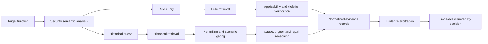

# VulDuet

VulDuet is a dual-path knowledge-augmented framework for LLM-based source-code vulnerability detection. It keeps normative security rules and historical vulnerability cases in separate retrieval and reasoning paths, converts both outputs into a shared evidence representation, and resolves agreement, complementarity, and conflict through evidence-grounded arbitration.

## Framework



The current public implementation corresponds to the V4 retrieval pipeline and V3 evidence arbiter:

1. **Security semantic analysis** extracts the purpose, security-sensitive objects, operations, data flow, and guards of a target function.
2. **Rule knowledge path** retrieves SEI CERT-style rules and verifies whether each rule applies to concrete code facts and whether its constraint is violated.
3. **Historical knowledge path** builds a scenario-oriented query, recalls historical vulnerability records, reranks them, and reasons over the strongest candidates.
4. **Evidence normalization** records source, polarity, grounding, confidence, and provenance in a common schema.
5. **Evidence arbitration** aligns risks, checks rebuttals, and produces the final label together with the primary evidence and decision mode.

## Repository layout

```text
src/
  agent/          semantic analysis, path reasoning, reranking, and arbitration
  config/         public model profiles and local-credential loader
  dataset/        paired PrimeVul loader
  embedding/      BGE embedding wrapper
  retrival/       FAISS rule and historical-knowledge retrieval
  evaluation/     paired and conventional evaluation metrics
  util/           evidence schemas, leakage audit, logging, and result saving
  test/           focused unit tests for the dual-path implementation
  main_*_v4.py    PrimeVul and SVEN experiment entry points
server_v4/        Linux setup, launch, and result-checking scripts
```

The directory name `retrival` is retained for compatibility with the current Python imports.

## Installation

Python 3.10 or newer is recommended.

```bash
git clone https://github.com/zhanghong203/VulDuet.git
cd VulDuet
python -m venv .venv
```

Activate the environment and install dependencies:

```bash
# Linux/macOS
source .venv/bin/activate

# Windows PowerShell
# .venv\Scripts\Activate.ps1

pip install -r requirements.txt
```

`FlagEmbedding` downloads the configured BGE model on first use. Set `RULE_RAG_EMBEDDING_DEVICE=cpu` to force CPU inference; otherwise the implementation uses `cuda:0` when CUDA is available.

## LLM configuration

Public model names and OpenAI-compatible endpoints are stored in `src/config/config.yml`. Adjust these endpoints to match your provider. Credentials must remain local:

```bash
cp src/config/config.local.example.yml src/config/config.local.yml
```

Then add the key only to `src/config/config.local.yml`:

```yaml
llm_profiles:
  deepseek_v3_2:
    api_key: "YOUR_API_KEY"
```

The local file is ignored by Git. Never commit API keys, tokens, or provider credentials.

## Data and knowledge preparation

This repository intentionally does not redistribute PrimeVul, SVEN, generated model outputs, or local FAISS indexes. Obtain the datasets from their original providers and place them in the following locations:

```text
data/test/primevul_test_paired.jsonl
data/test/sven/sven_cpp_pairs_official_423.jsonl
data/train/<primevul-training-split>.jsonl
data/knowledge/rules.json
```

The rule file is a JSON array. Each rule should include `rule_id`, `category`, `rule_full_title`, `risk_assessment`, and `extension_info`; the latter contains the risk description and optional compliant/noncompliant examples.

Historical knowledge must be constructed from training data only. Do not use validation or test functions when building the knowledge base.

### Build the rule index

The legacy rule builders use paths relative to `src/`, so run them from that directory:

```bash
cd src
python rule_to_document.py
python build_faiss.py
cd ..
```

This produces:

```text
output/step1/new_documents.json
output/retrival/new_rule.index
```

### Build the historical vulnerability index

First audit the training split for leakage, then extract and index historical knowledge:

```bash
python -m src.audit_vulnerability_knowledge_v3 data/train/<primevul-training-split>.jsonl
python -m src.build_vulnerability_knowledge_v3 \
  output/knowledge/clean_training_v3.json \
  --profile deepseek_v3_2 --workers 5 --retry-times 3
python -m src.build_vulnerability_index_v3
```

The resulting files are:

```text
output/step1/vulnerability_knowledge_v3_documents.json
output/retrival/vulnerability_knowledge_v3.index
```

## Running VulDuet

Run a small PrimeVul smoke test first:

```bash
python -m src.main_primevul_dual_path_v4 \
  --profile deepseek_v3_2 \
  --rule-top-k 5 \
  --knowledge-retrieval-top-k 5 \
  --knowledge-reasoning-top-k 3 \
  --minimum-scenario-match 0.2 \
  --minimum-confidence 0.5 \
  --workers 1 --reasoning-workers 3 --limit 2
```

Run the official 423-pair SVEN split:

```bash
python -m src.main_sven_dual_path_v4 \
  --dataset data/test/sven/sven_cpp_pairs_official_423.jsonl \
  --profile deepseek_v3_2 \
  --rule-top-k 5 \
  --knowledge-retrieval-top-k 5 \
  --knowledge-reasoning-top-k 3 \
  --minimum-scenario-match 0.2 \
  --minimum-confidence 0.5 \
  --workers 1 --reasoning-workers 3 --max-new 2
```

Both entry points save after every completed pair and resume by sample ID. Result files contain the two path outputs, retrieved and reranked evidence, normalized evidence, path decisions, arbitration result, timing, and configuration metadata.

## Evaluation

```bash
python -m src.evaluation.evaluation_dual_path_v3 \
  output/result/primevul/<result-file>.json \
  --save-json output/result/primevul/<metrics-file>.json

python -m src.evaluation.evaluate_sven_dual_path_v3 \
  output/result/sven/<result-file>.json
```

The evaluators report conventional classification metrics together with pair-aware measures for vulnerable/patched discrimination.

## Tests

The unit tests use mocks and do not require an API key or model download:

```bash
pytest -q src/test
```

## Reproducibility and safety notes

- Keep rule and historical knowledge sources isolated until evidence normalization.
- Build historical knowledge from training data only and retain the leakage-audit report.
- Record retrieval thresholds, top-k values, model profile, and dataset version for every run.
- Start with conservative concurrency because each sample can create multiple parallel LLM calls.
- Generated predictions are research outputs, not a substitute for expert security review.

## Citation

The paper citation will be added after publication. If you use this repository before then, please cite the repository URL and the accessed commit hash.
